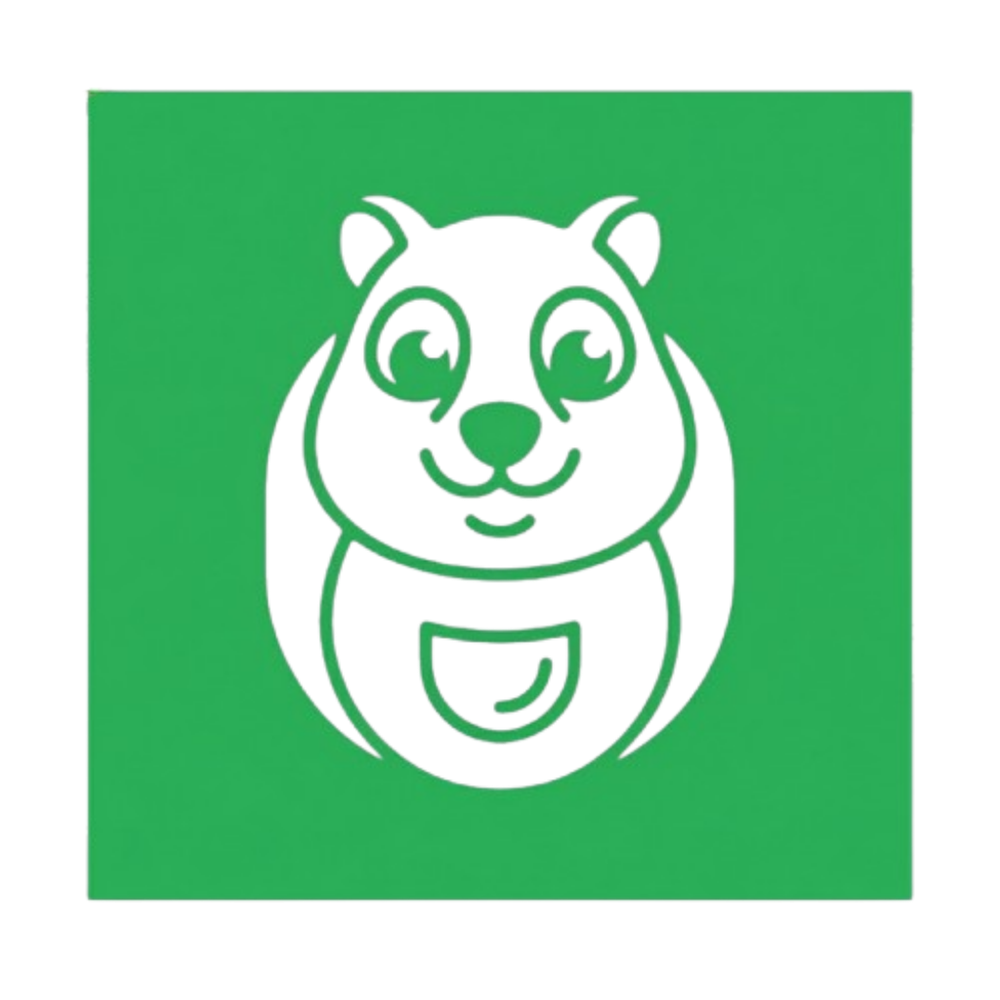
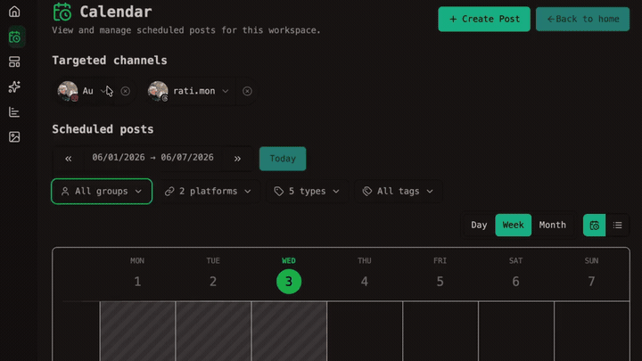
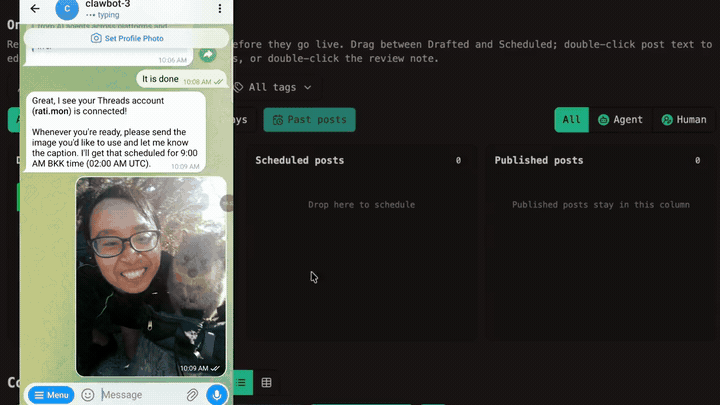
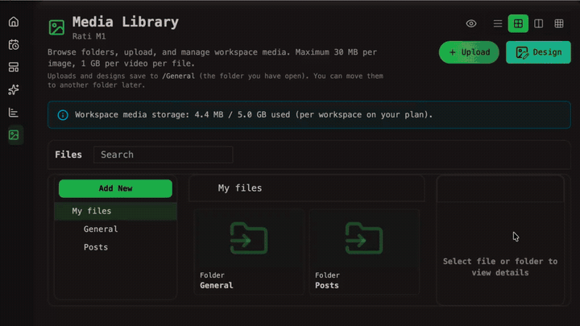
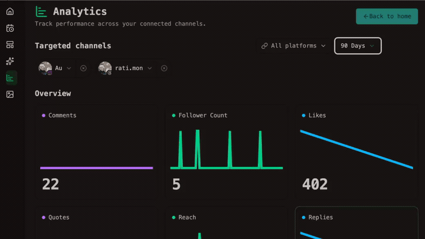

<p align="center">
  <a href="https://www.openquok.com" target="_blank">
    
  </a>
</p>

<p align="center">
  <!-- Badges -->
  <a href="https://github.com/Ratimon/openquok-monorepo/blob/main/LICENSE"></a>
  <a href="https://www.youtube.com/watch?v=iKNimZ9FBu8&t=1s"></a>
  <a href="https://discord.gg/wXgWcYzU4"></a>
</p>

<h1 align="center">OpenQuok: agent-native social media scheduling tool/workspace</h1>

It helps individuals or teams to run many social accounts at scale (especially as AI multiplies output) with an automation pipeline—draft, schedule, and publish—plus review and approval workflows so humans give final sign-off before anything goes live

It also offers a forkable, self-hosted alternative to closed SaaS schedulers (Buffer, Hypefury, and etc).

Use the **dashboard** to review, schedule and approve with a clear path from draft to post. Fits naturally on top of AI tooling like **OpenClaw**.

Use the **`@openquok/auto-cli`**, CLI-first for AI agents and scripts, to give them the same scheduling surface to autonomously schedule posts, manage integrations, and upload media from the terminal.


<p align="center">
  <a href="https://www.openquok.com/sign-up">Sign up</a>
  · <a href="https://www.openquok.com/docs/apis-integrations">Public API</a>
  · <a href="https://www.openquok.com/tools/skill-builder">Skill Builder</a>
  · <a href="https://www.openquok.com/tools/photo-editor">Photo Editor</a><br />
</p>

---

## Packages

| Package | Description |
|---|---|
| [`@openquok/auto-cli`](./agent) | CLI-first scheduling interface for AI agents and automation scripts |
| [`@openquok/node-sdk`](./sdk) | Typed Node.js client for the OpenQuok public API |

---

## How it works

Let AI agents handle volume — drafting and scheduling at scale. You handle quality: review and approve what goes live across your channels.

<div align="center">

**Terminal** (`openquok` CLI · schedule posts · upload media · flip draft ↔ scheduled)  ·  **Chat** (OpenClaw · Hermes · Claude · Cursor)  ·  **Web UI** (calendar · kanban review · analytics · approve before publish)

| <a href="assets/readme/2-calendar-filters.gif"></a> | <a href="assets/readme/3-kanban-filters.gif"></a> |
| :---: | :---: |
| <a href="assets/readme/4-file-manager.gif"></a> | <a href="assets/readme/5-analytics.gif"></a> |


</div>

---

### Prerequisites

- Node.js 24+
- Corepack (for pnpm)

```bash
corepack enable
```

---

### Tech stack

- PNPM workspace
- Supabase DB & Auth
- Cloudflare R2
- Express.js
- Svelte 5
- Tailwind CSS
- DaisyUI
- Redis
- Stripe
- Resend
- Sentry
- Posthog
- Vercel
- Railway

---

### Quick start

For a first-time local run — install dependencies, configure env for `backend/` and `web/`, and wire optional workers / CLI auth — follow the [Quick Start Guide](https://www.openquok.com/docs/getting-started-for-dev/quick-start).

Day-to-day commands (dev servers, tests, DB, deploy) live under [Development environment](https://www.openquok.com/docs/installation/development-environment). Production deploy notes are in [Production deployment](https://www.openquok.com/docs/installation/production-deployment).

---

### Links

- [Official Website](https://www.openquok.com)

**Documentation (by audience)**

- [CLI & agent users](https://www.openquok.com/docs) — `@openquok/auto-cli`, auth, commands, and examples
- [Public API](https://www.openquok.com/docs/getting-started-for-public-api) — programmatic access with workspace tokens
- [MCP](https://www.openquok.com/docs/getting-started-for-mcp) — Model Context Protocol setup and examples
- [Self-host & contributors](https://www.openquok.com/docs/getting-started-for-dev) — monorepo layout, install, and local setup
- [Contributing](https://www.openquok.com/docs/developer-guidelines) — repo conventions and contribution guides

**Self-host & setup**

- [Quick start](https://www.openquok.com/docs/getting-started-for-dev/quick-start)
- [Architecture](https://www.openquok.com/docs/getting-started-for-dev/architecture)
- [Installation](https://www.openquok.com/docs/installation)
- [Social integrations](https://www.openquok.com/docs/social-integration) — connect channels (OAuth, env, provider dashboards)
- [Admin setup](https://www.openquok.com/docs/admin) — platform admin, OAuth apps, and post-deploy setup
- [OAuth2 for apps](https://www.openquok.com/docs/oauth2-for-apps) — Authorization Code flow for third-party apps
- [Configuration – Backend](https://www.openquok.com/docs/configuration-backend)
- [Configuration – Web](https://www.openquok.com/docs/configuration-web)
- [Configuration – Workers](https://www.openquok.com/docs/configuration-worker)
- [Configuration – CLI auth server](https://www.openquok.com/docs/configuration-agent)

**Guidelines**

- [Developer guidelines](https://www.openquok.com/docs/developer-guidelines)
- [Security guidelines](https://www.openquok.com/docs/developer-guidelines/security)
- [Documentation contribution](https://www.openquok.com/docs/documentation-contribution)

---

### License

| Path | License |
|------|---------|
| Repository default (`backend/`, `web/`, `orchestrator/`, `sdk/`, `agent/src/`, …) | [AGPL-3.0-or-later](LICENSE) |
| `agent/skills/` | [MIT](agent/skills/LICENSE) |

Compiled CLI code published as [`@openquok/auto-cli`](https://www.npmjs.com/package/@openquok/auto-cli) is AGPL-3.0-or-later. Agent skills under `agent/skills/` are MIT so they can be copied into other agent setups without AGPL obligations on the skill text alone.

<br /><br /><br />

<p align="center">
  <a href="https://www.trustpilot.com/review/openquok.com" target="_blank">
    
  </a>
</p>
