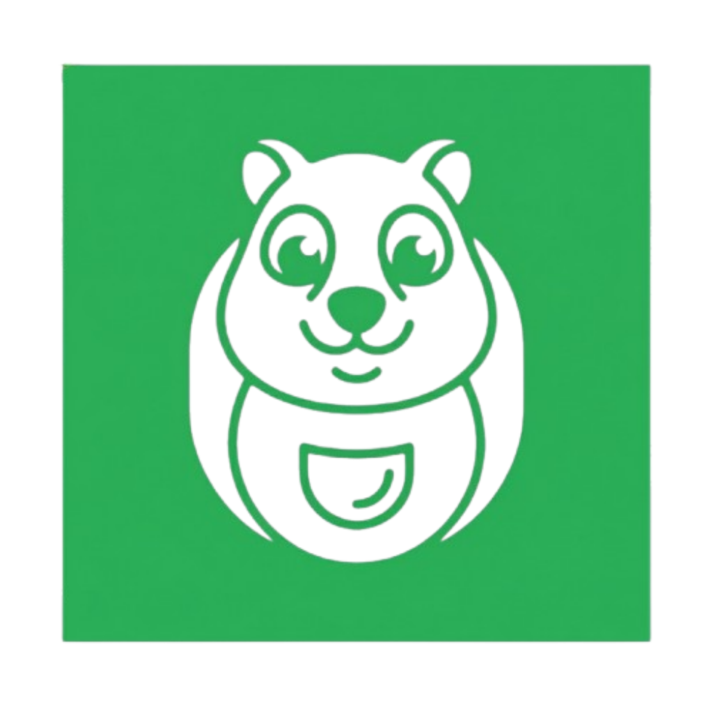
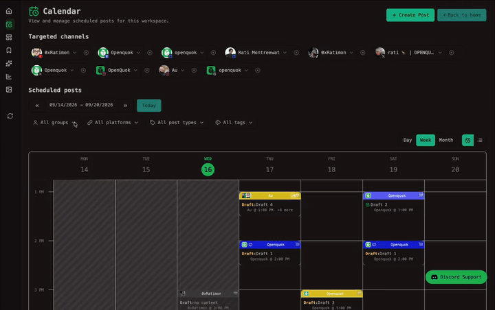
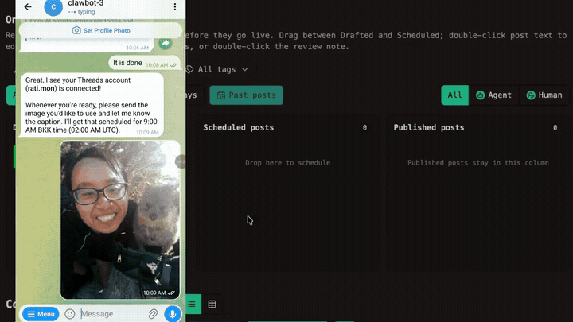
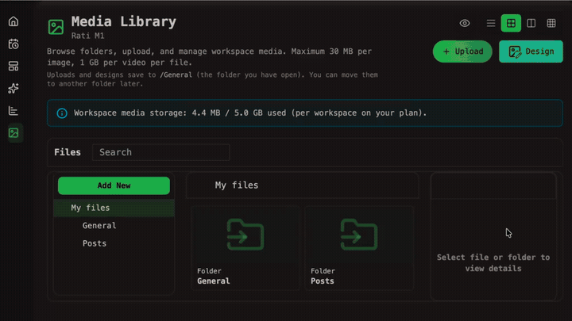
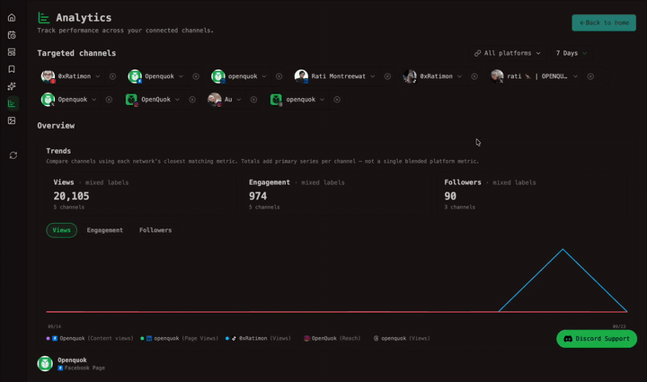
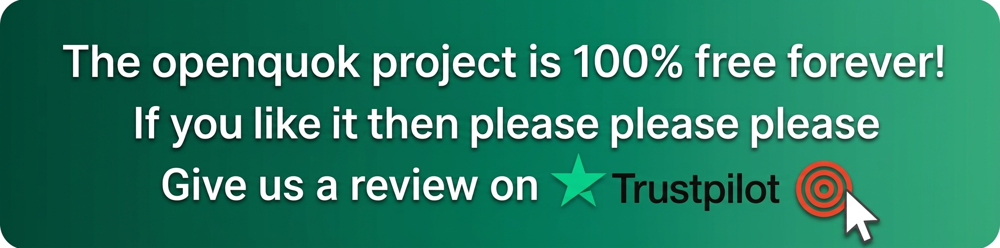

<p align="center">
  <a href="https://www.openquok.com" target="_blank">
    
  </a>
</p>

<h1 align="center">OpenQuok: agent-native social media scheduling tool/workspace
</h1>

<p align="center">
  <!-- Badges -->
  <a href="https://github.com/Ratimon/openquok-monorepo/blob/main/LICENSE"></a>
  <a href="https://www.youtube.com/watch?v=iKNimZ9FBu8&t=1s"></a>
  <a href="https://discord.gg/wXgWcYzU4"></a>
</p>

<p align="center">
  <a href="https://www.openquok.com/sign-up">Sign up</a>
  · <a href="https://www.openquok.com/tools/skill-builder">Skill Builder</a>
  · <a href="https://www.openquok.com/tools/photo-editor">Photo Editor</a>
  · <a href="https://www.openquok.com/tools/humanizer">Humanizer</a>
  · <a href="https://www.openquok.com/docs/getting-started-for-public-api">Public API</a><br />
</p>

OpenQuok helps individuals and teams run many social accounts at scale — especially as AI multiplies output. Draft, schedule, and publish from one workspace, with review and approval before anything goes live. Use the dashboard, or connect agents through the CLI, MCP, and public API. Self-host when you want an open alternative to closed SaaS schedulers.

## What you can do

-  **[Connect channels](https://www.openquok.com/docs/channels/connect).** Add Facebook Page, Threads, Instagram, LinkedIn, X, YouTube, TikTok, and Dev.to to a workspace. Each network keeps its own posting rules and limits — see the [channel catalog](https://www.openquok.com/channels).
-  **[Compose for each platform](https://www.openquok.com/docs/creating-posts).** Write once in Global mode or unlock a channel for its own caption, media, and settings. Preview each version before you schedule — see [Global vs per-channel](https://www.openquok.com/docs/creating-posts/global-vs-per-channel).
-  **[Photo editor](https://www.openquok.com/tools/photo-editor).** Design and resize visuals for social channels in your browser. Pick platform aspect ratios, export PNG free, or save to your workspace when signed in.
-  **[Humanizer](https://www.openquok.com/tools/humanizer).** Rewrite drafts so they read less machine-written. Human and Roughen modes run on-device in Chrome — no account required to copy results.
-  **[Calendar and kanban](https://www.openquok.com/docs/calendar-and-posts).** Plan posts on the calendar, drag to reschedule, and review drafts on Home kanban — see [Kanban board](https://www.openquok.com/docs/creating-posts/kanban) and [Moving posts](https://www.openquok.com/docs/calendar-and-posts/moving-posts).
-  **[Review and approvals](https://www.openquok.com/docs/calendar-and-posts/approvals).** Share preview links and collect client comments before you schedule. Humans give final sign-off before anything goes live.
-  **[Scheduling and time slots](https://www.openquok.com/docs/creating-posts/scheduling).** Save drafts, pick a publish time, or use [posting time slots](https://www.openquok.com/docs/channels/time-slots) per channel. Bundle channels into [channel groups](https://www.openquok.com/docs/channels/channel-groups) for clients or brands.
-  **[Media library](https://www.openquok.com/docs/creating-posts/media).** Upload from your device, reuse files from your workspace library, or attach saved media without uploading again. Per-channel lists apply when networks disagree on formats.
-  **[Threads and follow-up comments](https://www.openquok.com/docs/creating-posts/threads-and-comments).** Schedule multi-part posts and timed replies on supported networks. Delays, thread finisher, and cross-account plugs are covered in [Automations](https://www.openquok.com/docs/automations).
-  **[Templates and tags](https://www.openquok.com/docs/getting-started/glossary#template).** Save composer presets at [/account/templates](https://www.openquok.com/account/templates) for repeat workflows and label campaigns with [tags](https://www.openquok.com/docs/getting-started/glossary#tag) in the composer footer.
-  **[Analytics](https://www.openquok.com/docs/calendar-and-posts/actions-and-stats).** Compare post results and track audience changes across connected accounts. Per-network availability is listed under [Posting rules by platform](https://www.openquok.com/docs/platforms#analytics).
-  **[AI drafting](https://www.openquok.com/docs/creating-posts/ai-generation).** Queue posts from agents, the CLI, or the public API. Everything lands in the same review queue — you approve what publishes.
-  **[API, CLI, and MCP](https://www.openquok.com/docs/automations).** Create drafts, schedule posts, and check publishing results from scripts or agent clients. Start with [CLI](https://www.openquok.com/docs/getting-started-for-cli), [MCP](https://www.openquok.com/docs/getting-started-for-mcp), or the [Public API reference](https://www.openquok.com/docs/getting-started-for-public-api).
-  **[Free creator tools](https://www.openquok.com/tools).** [Skill Builder](https://www.openquok.com/tools/skill-builder) exports agent skills, [Best time to post](https://www.openquok.com/tools/best-time-to-post) builds timing test plans, and channel-specific pages exist for each shipped network.
-  **[Teams and workspaces](https://www.openquok.com/docs/settings/team).** Keep brands and clients in separate workspaces, invite teammates, and manage timezone, profile, and [developer tokens](https://www.openquok.com/docs/settings/developers).

## Supported platforms

<p>
  <a href="https://www.openquok.com/channels/facebook"></a>
  <a href="https://www.openquok.com/channels/threads"></a>
  <a href="https://www.openquok.com/channels/instagram"></a>
  <a href="https://www.openquok.com/channels/linkedin"></a>
  <a href="https://www.openquok.com/channels/x"></a>
  <a href="https://www.openquok.com/channels/youtube"></a>
  <a href="https://www.openquok.com/channels/tiktok"></a>
  <a href="https://www.openquok.com/channels/devto"></a>
</p>

OpenQuok ships integrations for **Facebook Page**, **Threads**, **Instagram** (Business and Standalone), **LinkedIn** profile and Page, **X**, **YouTube**, **TikTok**, and **Dev.to**. Dev.to connects with a personal API key in Add Channel — no OAuth redirect.

Posting formats, follow-up comments, and analytics vary by platform. Some integrations require provider app approval or publicly reachable media URLs on self-hosted deployments.

[Connect channels](https://www.openquok.com/docs/channels/connect) · [Posting rules by platform](https://www.openquok.com/docs/platforms) · [Channel catalog](https://www.openquok.com/channels) · [Social integrations (self-host)](https://www.openquok.com/docs/social-integration)

## Supported Agents & MCP

<p>
  <a href="https://www.openquok.com/agents/openclaw"></a>
  <a href="https://www.openquok.com/agents/hermes"></a>
  <a href="https://www.openquok.com/agents/grok-bot"></a>
  <a href="https://www.openquok.com/agents/thinkrail"></a>
  <a href="https://www.openquok.com/agents/cursor"></a>
  <a href="https://www.openquok.com/agents/claude-code"></a>
  <a href="https://www.openquok.com/agents/claude-cowork"></a>
  <a href="https://www.openquok.com/agents/chatgpt"></a>
  <a href="https://www.openquok.com/agents/codex"></a>
  <a href="https://www.openquok.com/agents/vscode-copilot"></a>
  <a href="https://www.openquok.com/agents/devin-desktop"></a>
  <a href="https://www.openquok.com/agents/amp"></a>
  <a href="https://www.openquok.com/agents/antigravity-cli"></a>
  <a href="https://www.openquok.com/agents/warp"></a>
</p>

**Agent hosts** — **OpenClaw**, **Hermes Agent**, **Grok Bot**, and **ThinkRail** — install the `@openquok/auto-cli` skill and schedule from chat or a terminal. **MCP clients** — **Cursor**, **Claude Code**, **Claude Cowork**, **ChatGPT**, **Codex**, **VS Code / Copilot**, **Devin Desktop**, **Amp**, **Antigravity CLI**, and **Warp** — connect OpenQuok over HTTP with a workspace programmatic token. Drafts from every path land in the same review queue on Home and the calendar.

Create a programmatic token under **Account → Settings → Developers → Access**, or [start on Cloud](https://www.openquok.com/pricing) when you want hosted plans and billing handled for you.

[Agent setup guides](https://www.openquok.com/docs/agent-setup-guides) · [MCP setup guides](https://www.openquok.com/docs/mcp-setup-guides) · [CLI getting started](https://www.openquok.com/docs/getting-started-for-cli) · [MCP getting started](https://www.openquok.com/docs/getting-started-for-mcp) · [Agents catalog](https://www.openquok.com/agents) · [Pricing](https://www.openquok.com/pricing)

---

## Packages

| Package | Description |
|---|---|
| [`@openquok/auto-cli`](./agent) | CLI-first scheduling interface for AI agents and automation scripts |
| [`@openquok/node-sdk`](./sdk) | Typed Node.js client for the OpenQuok public API |

---

## How it works

Let AI agents handle volume — drafting and scheduling at scale. You handle quality: review and approve what goes live across your channels.

<div align="center">

**Terminal** (`openquok` CLI · schedule posts · upload media · flip draft ↔ scheduled)  ·  **Chat** (OpenClaw · Hermes · Claude · Cursor)  ·  **Web UI** (calendar · kanban review · analytics · approve before publish)

| <a href="assets/readme/2-calendar-filters.gif"></a> | <a href="assets/readme/3-kanban-filters.gif"></a> |
| :---: | :---: |
| <a href="assets/readme/4-file-manager.gif"></a> | <a href="assets/readme/5-analytics.gif"></a> |


</div>

---

### Prerequisites

- Node.js 24+
- Corepack (for pnpm)

```bash
corepack enable
```

---

### Quick start

For a first-time local run — install dependencies, configure env for `backend/` and `web/`, and wire optional workers / CLI auth — follow the [Quick Start Guide](https://www.openquok.com/docs/getting-started-for-dev/quick-start).

Day-to-day commands (dev servers, tests, DB, deploy) live under [Development environment](https://www.openquok.com/docs/installation/development-environment). Production deploy notes are in [Production deployment](https://www.openquok.com/docs/installation/production-deployment).

### Self-host (Docker Compose)

Run the full app stack from the repo:

```bash
cp infra/self-host/.env.example infra/self-host/.env
# fill PUBLIC_SUPABASE_* / SUPABASE_SECRET_KEY (and matching VITE_* for the web image)
docker compose -f infra/self-host/docker-compose.yml up --build
```

When the stack is up, open the UI at **http://localhost:4007** (API at **http://localhost:3000**). Full env and bring-up steps: [Docker Compose (self-host)](https://www.openquok.com/docs/installation/docker-compose).

---

### Tech stack

- PNPM workspace
- Supabase DB & Auth
- Cloudflare R2
- Express.js
- Svelte 5
- Tailwind CSS
- DaisyUI
- Redis
- Stripe
- Resend
- Sentry
- Posthog
- Vercel
- Railway

---

### Links

- [Official Website](https://www.openquok.com)

**Product docs (General tab)**

- [Getting started](https://www.openquok.com/docs/getting-started) — product overview; [Quickstart](https://www.openquok.com/docs/getting-started/quickstart) for a first post; [Glossary](https://www.openquok.com/docs/getting-started/glossary) and [Tour the app](https://www.openquok.com/docs/getting-started/tour-the-app)
- [Channels](https://www.openquok.com/docs/channels) — [connect](https://www.openquok.com/docs/channels/connect), [manage](https://www.openquok.com/docs/channels/manage), [time slots](https://www.openquok.com/docs/channels/time-slots), and [channel groups](https://www.openquok.com/docs/channels/channel-groups)
- [Creating posts](https://www.openquok.com/docs/creating-posts) — composer, [media](https://www.openquok.com/docs/creating-posts/media), [scheduling](https://www.openquok.com/docs/creating-posts/scheduling), [kanban](https://www.openquok.com/docs/creating-posts/kanban), and [AI generation](https://www.openquok.com/docs/creating-posts/ai-generation)
- [Calendar and posts](https://www.openquok.com/docs/calendar-and-posts) — [moving posts](https://www.openquok.com/docs/calendar-and-posts/moving-posts), [actions and stats](https://www.openquok.com/docs/calendar-and-posts/actions-and-stats), and [approvals](https://www.openquok.com/docs/calendar-and-posts/approvals)
- [Platforms](https://www.openquok.com/docs/platforms) — character limits, media rules, and per-network settings
- [Automations](https://www.openquok.com/docs/automations) — [plugs](https://www.openquok.com/docs/automations/plugs), internal, cross-account, and global rules
- [Settings](https://www.openquok.com/docs/settings) — timezone, team, profile, developers, signatures, and approved apps
- [Free tools](https://www.openquok.com/tools) — [Humanizer](https://www.openquok.com/tools/humanizer), [Photo editor](https://www.openquok.com/tools/photo-editor), [Skill Builder](https://www.openquok.com/tools/skill-builder), and [Best time to post](https://www.openquok.com/tools/best-time-to-post)
- [Cloud](https://www.openquok.com/docs/cloud) — hosted plans, [trial](https://www.openquok.com/docs/cloud/trial), [limits](https://www.openquok.com/docs/cloud/limits), and billing

**CLI, MCP, and Public API**

- [CLI & agent users](https://www.openquok.com/docs/getting-started-for-cli) — `@openquok/auto-cli`, auth, [core usages](https://www.openquok.com/docs/cli-usages), and [examples](https://www.openquok.com/docs/cli-examples)
- [MCP](https://www.openquok.com/docs/getting-started-for-mcp) — Model Context Protocol setup, [tools reference](https://www.openquok.com/docs/mcp-references/tools), and [examples](https://www.openquok.com/docs/mcp-examples)
- [Public API](https://www.openquok.com/docs/getting-started-for-public-api) — programmatic access with workspace tokens; [provider settings](https://www.openquok.com/docs/public-api-providers)
- [OAuth2 for apps](https://www.openquok.com/docs/oauth2-for-apps) — Authorization Code flow for third-party applications

**Self-host & setup**

- [Developer quick start](https://www.openquok.com/docs/getting-started-for-dev/quick-start) and [Architecture](https://www.openquok.com/docs/getting-started-for-dev/architecture)
- [Installation](https://www.openquok.com/docs/installation) — [Docker Compose](https://www.openquok.com/docs/installation/docker-compose), [system requirements](https://www.openquok.com/docs/installation/system-requirements), [development environment](https://www.openquok.com/docs/installation/development-environment), and [production deployment](https://www.openquok.com/docs/installation/production-deployment)
- [Social integrations](https://www.openquok.com/docs/social-integration) — operator OAuth apps, env keys, and provider dashboards
- [Admin setup](https://www.openquok.com/docs/admin) — platform admin, OAuth apps, and post-deploy setup
- [Configuration – Backend](https://www.openquok.com/docs/configuration-backend), [Web](https://www.openquok.com/docs/configuration-web), [Workers](https://www.openquok.com/docs/configuration-worker), and [CLI auth server](https://www.openquok.com/docs/configuration-agent)

**Contributing**

- [Developer guidelines](https://www.openquok.com/docs/developer-guidelines) and [Security guidelines](https://www.openquok.com/docs/developer-guidelines/security)
- [Contribution opportunities](https://www.openquok.com/docs/contribution-opportunities) — add a provider, translate docs, and more
- [Publish listings](https://www.openquok.com/docs/publish-listings) — Extensions Hub playbooks and building blocks
- [Documentation contribution](https://www.openquok.com/docs/documentation-contribution)

**Blog**

- [Warm up a TikTok account](https://www.openquok.com/blog/how-to-warm-up-a-tiktok-account-to-reach-a-us-audience) — device setup and posting cadence before you scale carousels or agent-scheduled posts

---

### License

| Path | License |
|------|---------|
| Repository default (`backend/`, `web/`, `orchestrator/`, `sdk/`, `agent/src/`, …) | [AGPL-3.0-or-later](LICENSE) |
| `agent/skills/` | [MIT](agent/skills/LICENSE) |

Compiled CLI code published as [`@openquok/auto-cli`](https://www.npmjs.com/package/@openquok/auto-cli) is AGPL-3.0-or-later. Agent skills under `agent/skills/` are MIT so they can be copied into other agent setups without AGPL obligations on the skill text alone.

<br /><br /><br />

## Star History

<p align="center">
  <a href="https://star-history.com/#Ratimon/openquok-monorepo&Date">
    <picture>
      <source media="(prefers-color-scheme: dark)" srcset="https://api.star-history.com/svg?repos=Ratimon/openquok-monorepo&type=Date&theme=dark" />
      <source media="(prefers-color-scheme: light)" srcset="https://api.star-history.com/svg?repos=Ratimon/openquok-monorepo&type=Date&theme=light" />
      
    </picture>
  </a>
</p>

<p align="center">
  <a href="https://www.trustpilot.com/review/openquok.com" target="_blank">
    
  </a>
</p>
