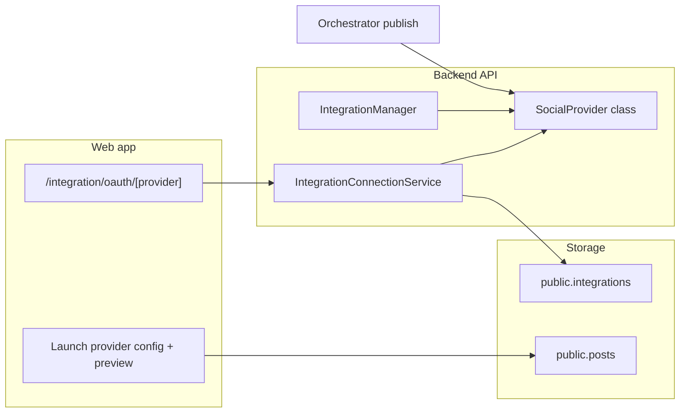

## Overview

Openquok social channels are **first-party provider classes** registered in the backend, exposed through existing REST routes, and optionally wired in the web composer. There is no runtime plugin loader — each provider is a deliberate code change across a small, predictable set of files.

Use **Facebook** (<Badge text="facebook" variant="default" />), **Instagram (Business)** (<Badge text="instagram-business" variant="default" />), and **Threads** (<Badge text="threads" variant="default" />) as reference implementations.

<Callout type="note" title="Identifier contract">
The provider <Badge text="identifier" variant="param" /> slug (kebab-case) is the contract everywhere: database <Badge text="provider_identifier" variant="param" />, OAuth callback path <Badge text="/integration/oauth/{identifier}" variant="path" />, catalog entries, CLI filters, and web routing.
</Callout>

## Architecture

**OAuth (typical):**

1. Web calls <Badge text="GET /api/v1/integrations/social/:provider" variant="path" /> → `generateAuthUrl()`.
2. User consents at the platform; browser returns to <Badge text="/integration/oauth/:provider" variant="path" />.
3. Web calls <Badge text="POST /api/v1/integrations/social-connect/:provider" variant="path" /> → `authenticate()`.
4. If <Badge text="isBetweenSteps" variant="param" /> is true, response includes <Badge text="pages" variant="param" />; user picks an account → <Badge text="POST /api/v1/integrations/provider/:id/connect" variant="path" /> → `fetchPageInformation()`.

**Publishing:** the orchestrator loads post rows, builds <Badge text="PostDetails" variant="default" /> (content + JSON settings + media), and calls <Badge text="provider.post()" variant="default" />.

## Backend checklist

<Steps>

### 1. Implement `SocialProvider`

Create a class under <Badge text="backend/integrations/providers/" variant="path" /> implementing <DocsExternalLink href="https://github.com/Ratimon/openquok-monorepo/blob/main/backend/integrations/social.integrations.interface.ts"><Badge text="social.integrations.interface.ts" variant="path" /></DocsExternalLink>.

Required surface:

| Member | Purpose |
| --- | --- |
| <Badge text="identifier" variant="param" /> / <Badge text="name" variant="param" /> | Catalog slug and display name |
| <Badge text="scopes" variant="param" /> | OAuth scopes |
| <Badge text="isBetweenSteps" variant="param" /> | `true` when user must pick Page/account after OAuth |
| <Badge text="generateAuthUrl" variant="param" /> / <Badge text="authenticate" variant="param" /> | OAuth start + code exchange |
| <Badge text="post" variant="param" /> | Publish scheduled content |
| <Badge text="maxLength" variant="param" /> | Caption limit for API + UI |

Common optional members:

| Member | When |
| --- | --- |
| <Badge text="pages()" variant="param" /> | Between-steps account list |
| <Badge text="fetchPageInformation()" variant="param" /> | Finalize Page/token after picker |
| <Badge text="refreshToken" variant="param" /> + <Badge text="reConnect" variant="param" /> | Long-lived token refresh (set <Badge text="refreshCron: true" variant="param" />) |
| <Badge text="comment" variant="param" /> | Thread / follow-up replies |
| <Badge text="analytics" variant="param" /> / <Badge text="postAnalytics" variant="param" /> | Insights dashboards |
| <Badge text="validateCreatePost" variant="param" /> | Server-side schedule validation |
| <Badge text="globalPlugCatalog" variant="param" /> / <Badge text="internalPlugCatalog" variant="param" /> | Channel or post-compose plugs |

**Config rule:** read secrets only from <Badge text="config.integrations.*" variant="path" /> in <Badge text="GlobalConfig.ts" variant="path" /> — never <Badge text="process.env" variant="param" /> inside provider code.

**Redirect URIs:** build with <Badge text="oauthFrontendOrigin()" variant="param" /> + <Badge text="oauthFrontendSocialCallbackPath(identifier)" variant="param" /> so local HTTP dev uses the HTTPS relay consistently.

**Media:** composer stores object keys in post JSON; resolve public URLs with <Badge text="publicUrlForObjectKey" variant="param" /> (see Threads / Facebook publish helpers).

### 2. Register the provider

Add `new YourProvider()` to the array in <Badge text="backend/integrations/integrationManager.ts" variant="path" />.

No new API routes are required — existing integration endpoints dispatch by identifier.

### 3. Token refresh / between-steps storage

If OAuth returns a **user token** but publishing needs a **Page or sub-account token**, follow the Instagram (Business) / Facebook pattern in <Badge text="IntegrationConnectionService.saveProviderPageForOrganization" variant="path" />:

- Store the Page token in <Badge text="token" variant="param" />.
- Keep the user token in <Badge text="refresh_token" variant="param" />.
- Keep the pre-picker user id in <Badge text="root_internal_id" variant="param" /> for <Badge text="reConnect" variant="param" /> during cron refresh.

Extend the `preservesUserTokenForRefresh` branch when adding another Meta-style provider.

### 4. Environment variables

Add keys to <Badge text="backend/config/GlobalConfig.ts" variant="path" /> and <Badge text="backend/.env.development.example" variant="path" />. If orchestrator workers need the same keys, mirror them per the orchestrator env rule.

### 5. Database

Usually **no migration** — `integrations.provider_identifier` is free text. Add migrations only for new columns, plug tables, or RLS changes.

### 6. Tests (when behavior is non-trivial)

Add unit tests beside the provider (OAuth edge cases, publish payload shaping). Extend <Badge text="IntegrationConnectionService.unit.test.ts" variant="path" /> when between-steps save logic differs.

</Steps>

## Web checklist

The **connect catalog** is backend-driven (<Badge text="GET /integrations" variant="path" />). The **composer** is opt-in per provider.

<Steps>

### 1. Launch provider config

Add <Badge text="web/src/lib/ui/components/posts/providers/{id}/{id}.provider.ts" variant="path" /> exporting a <Badge text="LaunchProviderConfig" variant="default" /> (`maximumCharacters`, `postComment`, optional `checkValidity`).

Register it in <Badge text="getLaunchProviderConfig" variant="param" /> inside <Badge text="providers/index.ts" variant="path" />.

### 2. Preview component (recommended)

Add a provider-specific preview Svelte component and branch in <Badge text="ShowAllProviders.svelte" variant="path" />.

### 3. OAuth between-steps UI

Reuse <Badge text="IntegrationContinue.svelte" variant="path" /> on route <Badge text="/integration/oauth/[provider]" variant="path" />. When <Badge text="isBetweenSteps" variant="param" /> is true:

- Map connect response `pages` in <Badge text="ContinueIntegration.presenter.svelte.ts" variant="path" />.
- Render a picker and call <Badge text="integrationsRepository.saveProviderPage" variant="param" /> with the payload your `fetchPageInformation` expects.

### 4. Labels and icons

Add display names to <Badge text="web/src/data/social-providers.ts" variant="path" /> if the slug is new. Icons may already exist for marketing placeholders.

### 5. Settings panel (optional)

If the provider needs compose-time options (Instagram post type, etc.), add Svelte settings under <Badge text="providers/{id}/" variant="path" /> and wire <Badge text="SettingsAccordion.svelte" variant="path" />.

</Steps>

## Documentation and agent resources

When shipping a user-facing provider, add:

| Artifact | Location |
| --- | --- |
| Setup guide | <Badge text="web/src/content/docs/social-integration/{id}.md" variant="path" /> |
| Index LinkCard | <Badge text="social-integration/index.md" variant="path" /> |
| CLI examples | <Badge text="web/src/content/docs/cli-examples/{id}.md" variant="path" /> |
| Agent recipes | <Badge text="agent/skills/openquok-core/resources/{id}-examples.md" variant="path" /> |
| Identifier list | <Badge text="agent/skills/openquok-core/resources/patterns.md" variant="path" /> |

Follow <a href="/docs/how-to-write-docs">How to write docs</a> for MDX components, env badges, and redirect URI placeholders.

## Reference providers

<CardGrid>
<LinkCard title="Meta Threads" description="Single-step OAuth, media containers, plugs" href="/docs/social-integration/threads" />
<LinkCard title="Instagram" description="Business (Page picker) and Standalone Login" href="/docs/social-integration/instagram" />
<LinkCard title="Facebook Page" description="Facebook Login, Page picker, feed and video publish" href="/docs/social-integration/facebook" />
</CardGrid>

## PR review prompts

Before opening a PR, confirm:

- Redirect URI in Meta matches <Badge text="/integration/oauth/{identifier}" variant="path" /> exactly.
- Provider is registered in <Badge text="integrationManager.ts" variant="path" />.
- No secrets or third-party project names in comments or docs (repo neutrality rule).
- Composer validation matches backend `validateCreatePost` / publish rules.
- Live vs Development mode called out in docs when media visibility differs.
